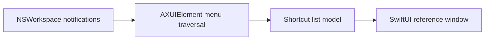

# Architecture

*Living document—update when modules and data flow change.*

## Goal

Show keyboard shortcuts for the **currently active application** in a dedicated window (floating / docked / compact modes later).

## High-level flow

## Components (current)

| Piece | Responsibility |
|-------|----------------|
| **ActiveAppObserver** | `NSWorkspace.didActivateApplicationNotification` → published frontmost app. |
| **MenuShortcutExtractor** | Given PID, `AXUIElementCreateApplication` → menu bar → walk menus/items; `kAXMenuItemCmdChar` / `CmdModifiers`. |
| **ShortcutReferenceModel** | Debounced refresh (~200ms), `AXIsProcessTrusted`, merges results into `@Published` list. |
| **ContentView** | `NavigationSplitView`: app info + Accessibility hint; detail list of shortcuts. |

## Components (planned)

| Piece | Responsibility |
|-------|----------------|
| **Shortcut store / cache** | Optional disk cache per bundle ID. |
| **Window / panel** | `NSPanel`, floating level, search/filter, copy row. |

## Permissions

- **Accessibility** — Required to read another app’s menu structure.

## Open decisions

Record outcomes in `docs/adr/`:

- Mac App Store + sandbox vs direct distribution.
- Non-activating panel default vs standard window.

## File map

| File | Role |
|------|------|
| `Package.swift` | SwiftPM: `ShortcutReferenceLibrary` + CLI `ShortcutReference` |
| `ShortcutReference.xcodeproj` | Xcode app → `ShortcutReference.app` (embeds `Sources/ShortcutReferenceLibrary`; no local SPM package in Xcode) |
| `MacApp/App.swift` | `@main` for bundled app |
| `Sources/ShortcutReferenceCLI/ShortcutReferenceCLIApp.swift` | `@main` for `swift run` |
| `Sources/ShortcutReferenceLibrary/ShortcutReferenceRootView.swift` | Shared root view (public) |
| `Sources/ShortcutReferenceLibrary/ContentView.swift` | Main UI |
| `Sources/ShortcutReferenceLibrary/ShortcutReferenceModel.swift` | Observable state + refresh |
| `Sources/ShortcutReferenceLibrary/ActiveAppObserver.swift` | Frontmost app notifications |
| `Sources/ShortcutReferenceLibrary/MenuShortcutExtractor.swift` | AX traversal (budget / depth / cycle limits) |
| `Sources/ShortcutReferenceLibrary/AccessibilityIntrospectionPolicy.swift` | Skip list (e.g. Cursor) |
| `Sources/ShortcutReferenceLibrary/MenuShortcut.swift` | `MenuShortcut` model |
