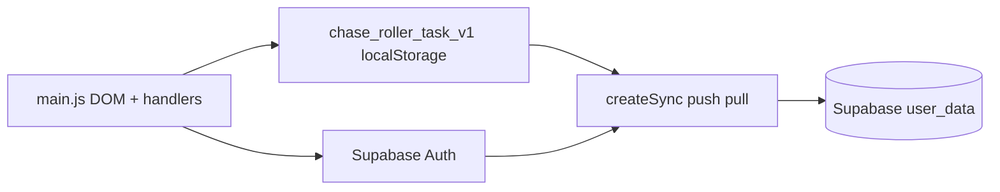

# Architecture

*Living document — update when modules and data flow change.*

## Goal

Deliver a **single-page** park-themed todo experience that **persists locally**, **syncs to Supabase** when authenticated, and **installs like an app** on iPhone.

## High-level flow



## Components

| Piece | Responsibility |
|-------|----------------|
| **`index.html`** | Static shell: styles, game markup, auth overlay sections, manifest/link tags. |
| **`src/sync.js`** | Binds `createSync` to `import.meta.env.VITE_SUPABASE_*`, exports `APP_KEY`. |
| **`src/shared/sync.js`** | Portfolio sync: `push`, `pull`, `auth` (or no-ops if no credentials). |
| **`src/main.js`** | Todo logic, `loadState` / `saveState`, `renderList`, notifications, clock; `initAuth` + OTP UI; `startApp` runs `pull` using a fresh `loadState()` snapshot, then sets `hasLoaded` so `push` does not race stale `_syncAt`. |
| **`public/manifest.json`** | PWA install metadata. |
| **`vercel.json`** | Cache-Control headers so clients pick up new builds quickly. |

## Data shape (JSON blob)

```json
{
  "tasks": [{ "id": "string", "text": "string", "done": boolean }],
  "cash": number,
  "_syncAt": number
}
```

## Permissions

- **Web only** — no native permissions. Supabase **anon key** is public; **RLS** on `user_data` enforces `auth.uid() = user_id`.

## Open decisions

Recorded in `docs/adr/` (e.g. Vite vs CRA, blob sync vs row-per-task).

## File map

| Path | Notes |
|------|--------|
| `index.html` | UI structure; `#authGate`, `#appRoot` |
| `src/main.js` | All runtime behavior |
| `src/sync.js` | Env + `APP_KEY` |
| `src/shared/sync.js` | Keep aligned with `/apps/shared/sync.js` |
