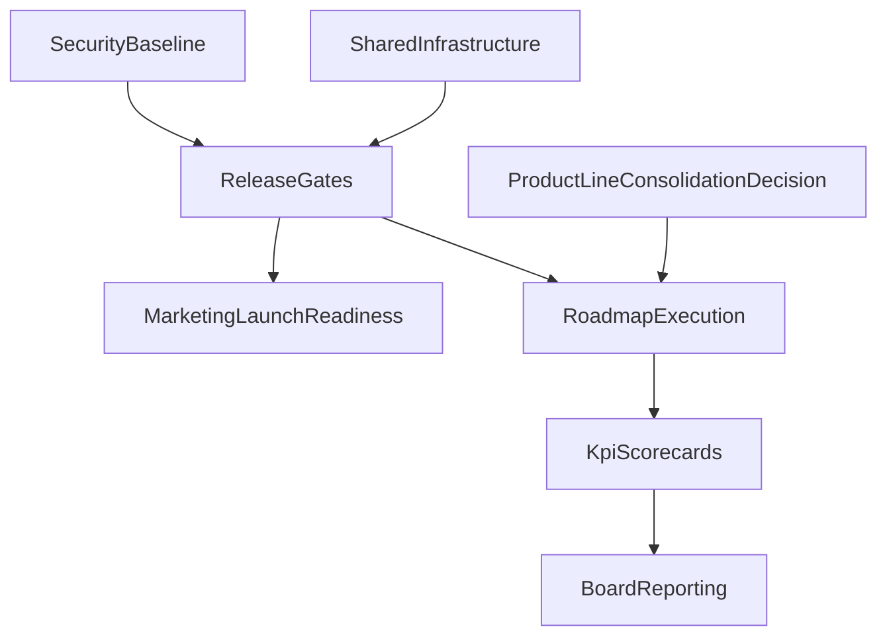

# Portfolio Executive Deep-Dive Report

Date: 2026-04-14  
Prepared for: CTO, CMO, CFO, CIO, CDO, CPO, COO, Legal/Compliance  
Scope: Local workspace portfolio (`/Users/chase/Developer/chase`, `/Users/chase/Developer/portfolio`) + authenticated GitHub account (`iamchasewhittaker`)

## Executive Summary

The portfolio shows strong shipping velocity and clear product craftsmanship, but it is fragmented across overlapping app surfaces and unevenly mature operating systems (docs quality is high overall, but governance drift is emerging). The biggest strategic opportunity is to consolidate around 3 product lines while improving execution infrastructure (shared components, testing, security controls, KPI instrumentation, and portfolio governance).

Top decisions recommended:

- Keep and invest in the Clarity ecosystem, Job Search HQ ecosystem, and core operator tooling (App Forge, Knowledge Base).
- Consolidate overlapping web/mobile surfaces through a product-line strategy, not ad hoc app-by-app growth.
- Treat archives as first-class portfolio assets with explicit retire-or-revive criteria.
- Upgrade vibecode governance (memory, `CLAUDE.md`, handoffs, review gates) to reduce rework and drift.
- Ship a board-level operating cadence with RACI ownership, stage gates, and financial/value tracking.

## Method and Evidence Base

Primary evidence:

- `/Users/chase/Developer/chase/CLAUDE.md`
- `/Users/chase/Developer/chase/ROADMAP.md`
- `/Users/chase/Developer/chase/HANDOFF.md`
- App-level `CLAUDE.md`, `HANDOFF.md`, `README.md`, and docs under `portfolio/*` and `projects/*`
- GitHub repo metadata from authenticated account (`iamchasewhittaker`)

Evaluation dimensions:

- Strategic fit, user value, differentiation, maintenance burden, delivery risk, reuse potential
- Security/data posture, marketing readiness, financial leverage
- Agile execution health, ownership clarity, and decision quality

## Portfolio Inventory Matrix

| Project                     | Type                | Status        | Purpose Served                                     | Current Maturity                     | Strategic Call                            |
| --------------------------- | ------------------- | ------------- | -------------------------------------------------- | ------------------------------------ | ----------------------------------------- |
| Wellness Tracker (web)      | Client app          | Active        | Unified daily wellness and life operations         | Mature web app, high iteration count | Keep, optimize maintainability            |
| Clarity Hub (web)           | Companion app       | Active        | Desktop companion for 5 Clarity iOS domains        | Early but functional                 | Keep, clarify role vs standalone spinouts |
| YNAB Clarity Web            | Client app          | Active        | Focused budgeting/YNAB dashboard                   | Stable v1 lane                       | Keep, tie into finance narrative          |
| RollerTask Tycoon Web       | Client app          | Active        | Gamified task/points tracker                       | Stable v1 lane                       | Keep, define web vs iOS split             |
| Clarity Command             | Client app          | Active        | Faith/family accountability and daily mission flow | Functional but positioning-sensitive | Keep, sharpen audience/message            |
| Job Search HQ (+ extension) | Client + extension  | Active        | Job pipeline + AI-assisted execution               | Mature and differentiated            | Keep, market as flagship vertical         |
| Knowledge Base              | Client app          | Active        | Personal knowledge and bookmark management         | Mature local-first utility           | Keep, clarify relation to App Forge       |
| App Forge                   | Internal tool       | Active        | Portfolio mission control and audit tool           | Useful, monolithic technical debt    | Keep, prioritize platform hardening       |
| Clarity iOS suite (5 apps)  | Client mobile suite | Active/local  | Domain-specific mobile life stack                  | Built with shared design language    | Keep, rationalize release strategy        |
| ClarityUI                   | Shared package      | Active        | Shared iOS design system package                   | Early but structurally valuable      | Keep, expand as reuse anchor              |
| YNAB Clarity iOS            | Client mobile       | Local         | Native YNAB companion + assign flow                | Promising                            | Incubate to release readiness             |
| RollerTask Tycoon iOS       | Client mobile       | Local/shipped | Native gamified productivity                       | Strong local product                 | Keep, align with web story                |
| Spend Clarity               | Internal Python CLI | Local         | Finance enrichment automation                      | Strong operator tool                 | Keep private/internal                     |
| Inbox Zero                  | Internal system     | Active        | Email triage automation + AI/rules                 | Useful ops layer                     | Keep internal                             |
| AI Dev Mastery              | Learning/content    | Local         | AI curriculum/course product                       | Undeployed                           | Incubate with go/no-go test               |
| Shortcut Reference          | Utility app         | Local         | macOS shortcut reference tool                      | Distinct but isolated                | Incubate or bundle strategically          |
| Archived apps/projects      | Archived            | Retired       | Historical lineage and experiments                 | Mixed archival quality               | Retire with explicit criteria             |

## Similar-App Comparison Matrix

| Similar Group        | Apps                                                               | Overlap                                                   | Difference                                               | Recommendation                                                         |
| -------------------- | ------------------------------------------------------------------ | --------------------------------------------------------- | -------------------------------------------------------- | ---------------------------------------------------------------------- |
| Clarity life domains | Wellness Tracker, Clarity Hub, Clarity iOS suite                   | Same life categories (check-in/triage/time/budget/growth) | Unified web monolith vs decomposed native ecosystem      | Keep both short-term; define one canonical user journey and data model |
| Money/YNAB           | YNAB Clarity Web, YNAB Clarity iOS, Spend Clarity, archive `money` | Budget clarity and transaction enrichment                 | End-user dashboard vs operator automation                | Keep first 3; formally retire archive assets                           |
| Task gamification    | RollerTask Web, RollerTask iOS, archived RollerTask web PWA        | Same motivation/game concept                              | Platform and UX form factor                              | Keep web+iOS; maintain archive as frozen reference only                |
| Career productivity  | Job Search HQ, Clarity Command, Inbox Zero                         | Daily execution and communication flow                    | Job pipeline vs faith accountability vs inbox operations | Keep separate but introduce integrated narrative/links                 |
| Portfolio operations | App Forge, Knowledge Base, App Hub                                 | Portfolio memory and navigation                           | Audit/ops vs knowledge curation vs scripts               | Keep all; tighten boundaries and data flow                             |

## Strengths

- High shipping cadence with frequent incremental improvements.
- Strong documentation culture (`CLAUDE.md`, `HANDOFF.md`, app docs).
- Consistent local-first architecture simplifies offline reliability.
- Shared Supabase strategy for selective sync across apps.
- Distinctive product identity in job search and personal operating-system tools.
- Meaningful design consistency in Clarity iOS branding and icon system.

## Weaknesses

- Product overlap creates cognitive and maintenance load.
- Some factual drift across docs (`URL`, paths, state instructions).
- Heavy dependence on monolithic files in key apps (notably `App.jsx`/large tabs).
- Limited public-facing market packaging for multiple promising products.
- No strong cross-portfolio telemetry layer for comparable KPI tracking.
- Sparse GitHub repo metadata hygiene (descriptions/topics/archival discipline).

## Missing Portfolio Capabilities

- Clear flagship product hierarchy (what is primary vs supporting).
- Standardized metrics and dashboards across all products.
- Security and data governance baseline controls codified as enforceable checks.
- Broader test automation beyond current build checks.
- Stronger external product marketing layer for active public apps.

## CTO Lens: Architecture and Engineering Priorities

1. Consolidate shared web utilities (`storage`, `sync`, `ui`, error handling).
2. Reduce monolith risk in high-change apps.
3. Standardize release quality gates per app class (web app, iOS app, internal tool).
4. Add portfolio telemetry contracts and health checks.
5. Introduce platform backlog (security, CI maturity, reliability hardening).

## CMO Lens: Marketing Readiness and Ship Timing

### Marketing posture by product

| Product Line               | Market Readiness                   | Marketing Quality Today                           | Ship Recommendation                               |
| -------------------------- | ---------------------------------- | ------------------------------------------------- | ------------------------------------------------- |
| Job Search HQ              | High                               | Strong utility story, needs polished proof assets | Ship now (public growth push)                     |
| Wellness/Clarity ecosystem | Medium                             | Strong depth, fragmented narrative                | 30-90 day message unification then campaign       |
| YNAB/finance tools         | Medium                             | High utility but niche framing                    | 60-90 day targeted positioning                    |
| RollerTask                 | Medium                             | Distinct identity, split across platforms         | Ship now to niche audience, refine onboarding     |
| Knowledge Base / App Forge | Medium-low external, high internal | Useful but currently operator-centric messaging   | Position as internal ops tools unless productized |

CMO actions:

- Build clear product-line messaging architecture (3 lines max).
- Produce launch assets: one-page story, demo clips, before/after outcomes, social proof.
- Align naming/taglines across web+iOS variants.
- Establish launch calendar with gated launch criteria.

## CFO Lens: Financial and Portfolio Capital Allocation

### Financial posture (inferred)

- Cost concentration likely sits in one large repository (`apps`) and broad maintenance spread.
- Many active surfaces increase maintenance burden relative to user-scale evidence.
- High ROI likely from consolidating overlap and prioritizing revenue/impact lines.

### Investment tiers

- Invest: Job Search HQ, Clarity core line, YNAB line, platform hardening.
- Maintain: Knowledge Base, App Forge, RollerTask cross-platform.
- Incubate: AI Dev Mastery, Shortcut Reference (require milestone proof).
- Retire/freeze: legacy archives without strategic reactivation case.

## CIO/CDO Lens: Data Security and Governance

### Current positives

- Explicit sensitive-data guidance in root policy.
- Clear separation patterns for select secrets (`.env`, keychain usage in Spend Clarity).
- Shared auth/sync model documented for web apps.

### Gaps and risks

- Mixed maturity in secrets handling across apps and extensions.
- LocalStorage-heavy architecture lacks centralized governance and auditing.
- Cross-file documentation drift can create policy implementation risk.
- No unified data classification matrix visible across portfolio.

### Priority controls

1. Data classification register (PII, financial, operational, low-risk).
2. Secret handling baseline and validation checks per app type.
3. Retention/deletion policy for local and cloud-synced data.
4. Security review checklist in stage gates before major launches.

## CDO Lens: Data Quality and Presentation Improvement

### How data looks now

- Strong app-level operational data structures, mostly local blob-oriented.
- Inconsistent cross-app metric definitions and reporting formats.
- Limited executive-friendly visual rollups across products.

### Better data presentation model

- Standard KPI dictionary shared across all products.
- Product scorecards: adoption, engagement, retention proxy, quality, risk.
- Portfolio rollup dashboard with trend lines and confidence flags.
- Narrative-first reporting format: insight, evidence, implication, action.

## CPO Lens: Product-Line Coherence

- Reduce duplicate pathways for similar user jobs.
- Define canonical journeys and handoffs between related apps.
- Convert app-by-app roadmap to product-line roadmap.
- Use comparison matrix to enforce deliberate differentiation.

## COO Lens: Delivery Throughput and Operating Model

- Adopt bi-weekly tactical portfolio review + monthly strategic review.
- Use stage gates to avoid shipping half-defined initiatives.
- Add capacity planning per pod to prevent context switching overload.
- Move from ad hoc prioritization to planned initiative lanes.

## Legal/Compliance Lens

- Formalize privacy/terms posture for any public-facing apps with user data.
- Confirm third-party API and email automation compliance boundaries.
- Add AI usage policy notes for generated outputs and user data handling.

## Vibecoder Improvement Playbook

### What should be updated in `CLAUDE.md`

- App identity (version, URL, keys, status)
- Current architecture and commands
- Non-negotiable constraints
- Security handling and known critical warnings
- Links to active `HANDOFF.md`, `ROADMAP.md`, design specs

### What should not be continuously updated in `CLAUDE.md`

- Ephemeral session logs
- Duplicated changelog narratives
- Speculative backlog ideation without ownership
- Redundant content copied from other canonical files

### Handoff quality baseline (`HANDOFF.md`)

- One authoritative state table (focus, next, blockers, last touch)
- Short recovery instructions
- Links to source plans/docs rather than duplicate details
- Remove or archive stale prompt blocks that compete with current state

### Vibecoder execution upgrades

1. Mandatory pre-flight checklist before major edits.
2. Quality gate checklist (build/test/security/docs) before shipping.
3. Automated doc drift checks (`CLAUDE.md` vs root table consistency).
4. Standardized prompt templates by initiative type.
5. End-of-session handoff enforcement and quality scoring.

## Archived Portfolio Strategy

Archive classes:

- Frozen reference (keep docs only)
- Revivable candidate (if strategic gap exists)
- Merge-candidate (concept absorbed elsewhere)
- Full retirement (de-prioritized and hidden from active view)

Current recommendation:

- Keep archive content for lineage and institutional memory.
- Mark each archived project with explicit class and review date.
- Remove ambiguous archive references from active maps.

## Agile/Scrum Operating Model

Cadence:

- Bi-weekly: tactical delivery + blocker review
- Monthly: portfolio steering (keep/merge/retire/incubate decisions)
- Quarterly: roadmap reset (90d/6m/12m investment shifts)

Pods:

- Product Pod A: Clarity + wellness
- Product Pod B: Job/career + RollerTask
- Platform Pod: shared infra, security, CI, docs governance, data quality

Definition of done upgrades:

- Build passes + critical tests
- Security checklist complete
- `CLAUDE.md` and `HANDOFF.md` updated and coherent
- KPI instrumentation updated
- Launch artifact quality pass (if externally shipped)

## RACI Matrix (Initiative-Level)

| Initiative                              | CTO | CMO | CFO | CIO/CDO | CPO | COO | Legal | Product | Eng |
| --------------------------------------- | --- | --- | --- | ------- | --- | --- | ----- | ------- | --- |
| Consolidate overlapping apps            | A   | C   | C   | C       | R   | C   | I     | R       | R   |
| Security/data governance baseline       | C   | I   | C   | A/R     | C   | C   | R     | I       | R   |
| Marketing launch system                 | C   | A/R | C   | I       | C   | C   | C     | R       | C   |
| Platform hardening (shared infra/tests) | A/R | I   | C   | C       | C   | C   | I     | C       | R   |
| KPI and scorecard rollout               | C   | C   | C   | A/R     | C   | C   | I     | R       | R   |
| Archive cleanup policy                  | C   | I   | C   | C       | R   | A   | C     | R       | C   |

Legend: A = Accountable, R = Responsible, C = Consulted, I = Informed

## Dependency Map and Critical Path

Critical path:

1. Product-line consolidation decisions
2. Shared infrastructure and security controls
3. Launch stage gates and KPI definitions
4. Marketing and board reporting execution

## Stage-Gate Launch Checklist

### Gate 1: Strategy/Problem Fit

- Clear target user and job-to-be-done
- Differentiation versus similar internal apps
- Success metrics defined

### Gate 2: Build Readiness

- Scope frozen for release increment
- Technical risk reviewed
- Data and security requirements defined

### Gate 3: Launch Readiness

- Product quality checks complete
- Security/privacy checklist passed
- Marketing assets and messaging approved
- Data dashboard and success baseline prepared

### Gate 4: Post-Launch

- Week 1 and week 4 KPI review
- Decision: scale, optimize, reposition, or sunset

## Benefits Tracking Model

For each initiative:

- Value hypothesis
- Baseline metrics
- Target metrics (2 weeks, 30 days, 90 days, 6 months, 12 months)
- Cost to deliver/maintain
- Risk and confidence score
- Review owner and cadence

## Portfolio Kill Criteria

Trigger review when any criterion is sustained:

- Strategic fit is low and declining
- No measurable usage/outcome traction after agreed runway
- Maintenance cost exceeds value contribution
- Security/compliance burden exceeds expected benefit
- Better internal alternative already exists

Action options: retire, merge, pause, or re-scope with explicit owner/date.

## Executive Decision Log (Initial)

| Decision                             | Owner       | Date       | Rationale                                       | Status   | Review Date |
| ------------------------------------ | ----------- | ---------- | ----------------------------------------------- | -------- | ----------- |
| Consolidate to 3 product lines       | CTO/CPO     | 2026-04-14 | Reduce overlap and execution drag               | Proposed | 2026-05-15  |
| Formalize security baseline controls | CIO/CDO     | 2026-04-14 | Reduce data/control risk across mixed app types | Proposed | 2026-05-01  |
| Launch Job Search HQ growth sprint   | CMO/Product | 2026-04-14 | Most market-ready product line                  | Proposed | 2026-04-30  |
| Archive governance policy adoption   | COO/CPO     | 2026-04-14 | Prevent portfolio sprawl and drift              | Proposed | 2026-05-15  |

## Time-Phased Roadmap

### 2 Weeks

- Publish unified project inventory and disposition table.
- Clean `CLAUDE.md`/`HANDOFF.md` drift in top-priority apps.
- Stand up stage-gate checklists and security baseline template.
- Define KPI dictionary and board scorecard skeleton.

### 30 Days

- Execute first consolidation decisions (low-risk overlap areas).
- Implement shared infrastructure quick wins (`storage`, `ui`, common checks).
- Launch marketing-ready assets for Job Search HQ.
- Establish portfolio review ritual and RACI operating cadence.

### 90 Days

- Complete first major product-line simplification.
- Roll out portfolio dashboard and benefits tracking.
- Improve test/quality guardrails in key web apps and one iOS lane.
- Finalize archive policy and lifecycle governance.

### 6 Months

- Mature product lines with clear user narratives and pricing/positioning options.
- Complete second wave of consolidation or deliberate differentiation.
- Demonstrate measurable KPI improvements across at least 2 flagship lines.

### 12 Months

- Operate a stable portfolio with deliberate investment tiers.
- Maintain board-level reporting discipline and predictable delivery cadence.
- Sustain lower maintenance-to-value ratio via governance and shared platform.

## Marketing Mini-Briefs (CMO Quick View)

- Job Search HQ: ship now; lead with outcome-focused career execution.
- Clarity/Wellness: unify narrative before major public push.
- YNAB line: target budget-conscious power users with clear proof flows.
- RollerTask: niche gamified productivity story with clearer onboarding.

## Data Presentation Blueprint (CDO/CIO/CFO)

Dashboard layers:

1. Board scorecard (portfolio health + risk + value)
2. Executive lens pages (CTO/CMO/CFO/CIO-CDO/CPO/COO/Legal)
3. Product scorecards (performance + quality + cost + risk)

Standard card format:

- Insight
- Evidence
- Business implication
- Recommended action
- Owner and due date

## Residual Risks

- Portfolio complexity may still outpace solo-team capacity.
- Launch quality may vary if stage gates are bypassed.
- Security drift risk remains if controls are policy-only.
- KPI quality depends on disciplined metric definitions and instrumentation.

## Conclusion

This portfolio has significant strategic upside and unusually strong maker momentum. The highest return now comes from management discipline: deliberate consolidation, security/data governance, executive-grade reporting, and a standardized vibecode operating model that preserves speed while reducing drift.