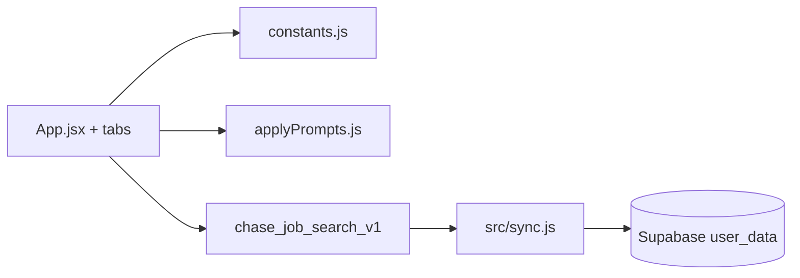

# Architecture — Job Search HQ

## Data flow

Apply Tools copy markdown from `applyPrompts.js` to the clipboard — no LLM network calls from the client.

## Key files

| Path | Role |
|------|------|
| `src/App.jsx` | Shell — state, load/save, navigation, modals; post-auth URL/hash import for extension |
| `src/constants.js` | Data, `s` styles, helpers |
| `src/applyPrompts.js` | External-assistant prompts + stage prep templates |
| `src/sync.js` | `APP_KEY = job-search`, `createSync` |
| `extension/` | Chrome MV3 — LinkedIn capture, HQ tab badge bridge (`content-jobhq-bridge.js`) |

See [extension/README.md](../extension/README.md) for load-unpacked steps and permissions.

## Deploy

Vercel **Root Directory:** `portfolio/job-search-hq`.
