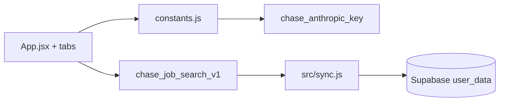

# Architecture — Job Search HQ

## Data flow

## Key files

| Path | Role |
|------|------|
| `src/App.jsx` | Shell — state, load/save, navigation, modals |
| `src/constants.js` | Data, `s` styles, `callClaude`, helpers |
| `src/sync.js` | `APP_KEY = job-search`, `createSync` |

## Deploy

Vercel **Root Directory:** `portfolio/job-search-hq`.
