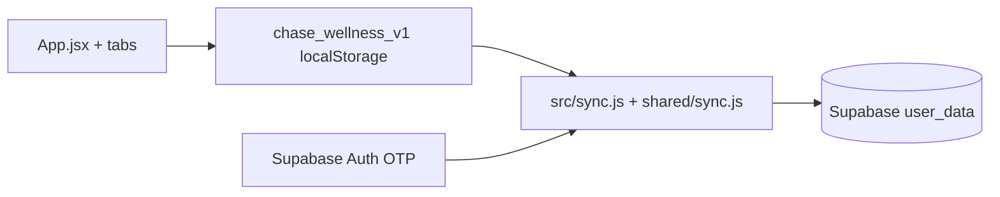

# Architecture — Wellness Tracker

## Data flow

## Key files

| Path | Role |
|------|------|
| `src/App.jsx` | Shell: state, load/save, modals, tab routing |
| `src/theme.js` | `T` tokens, `load` / `save`, draft + meds helpers |
| `src/sync.js` | `APP_KEY = wellness`, `createSync` from env |
| `src/shared/sync.js` | Copy of `portfolio/shared/sync.js` |

## Deploy

Vercel **Root Directory:** `portfolio/wellness-tracker` (monorepo).
